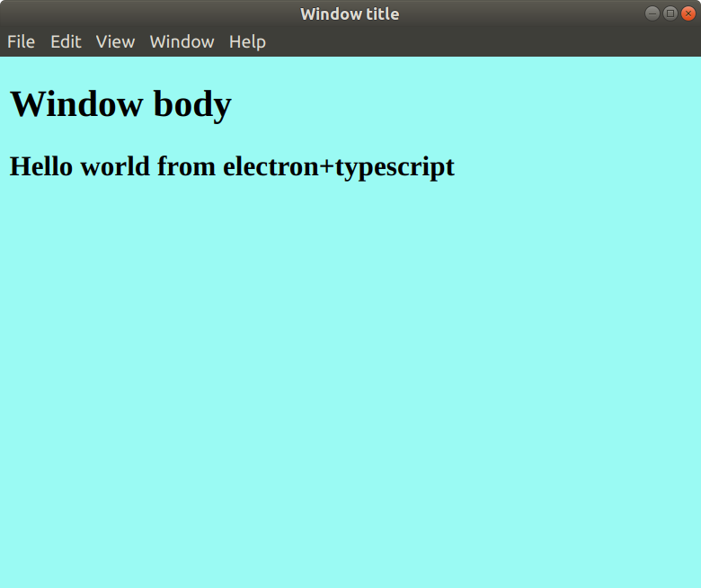

## Hello Electron-TypeScript
Simple hello world using Typescript to load a window using 'electron'

## Instructions
1 Auto install dependencies
````
$ npm install
````

2 Compile
````
$ tsc 
````
3 Run
````
$ npm start
````
---
## Output

Expected window:


---
## How to

1 Generate the package.json

`$ npm init `

2 Generate the tsconfig.json

`$ tsc --init`

3 Install electron

`$ npm install electron --save-dev`

* Or globally:

`$ npm install electron -g`

* If `EACCESS` error:

`$ sudo npm install electron --unsafe-perm=true -g`
